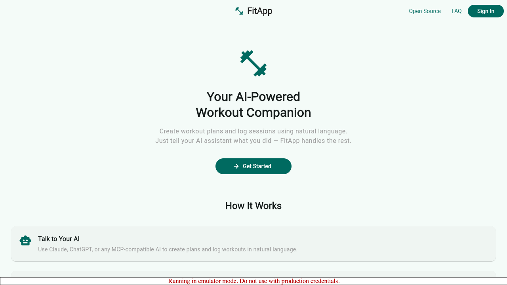
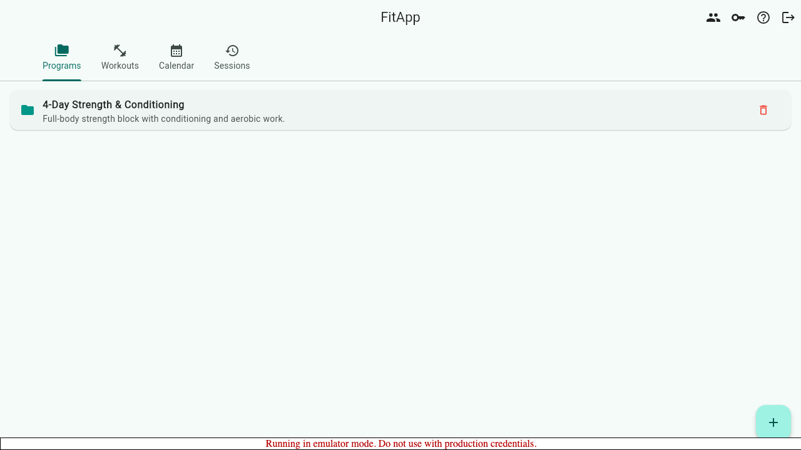
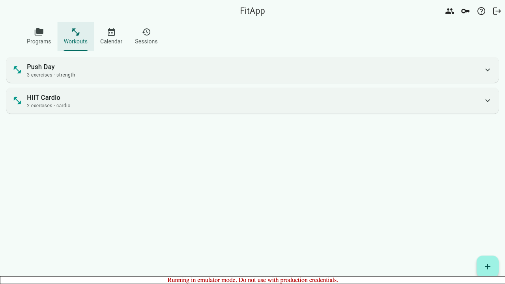
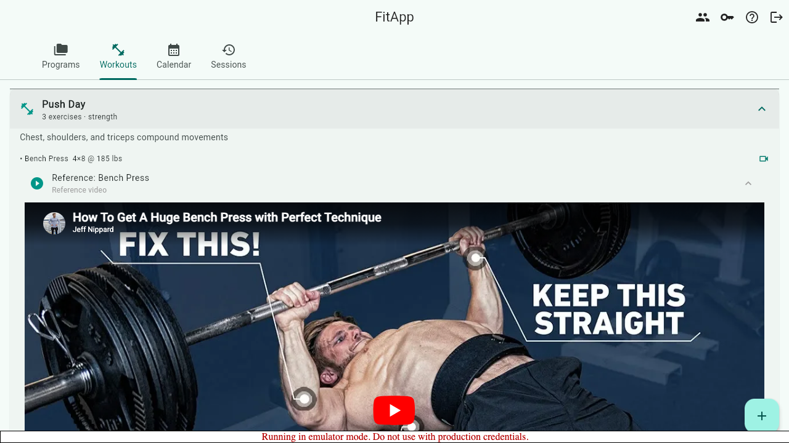
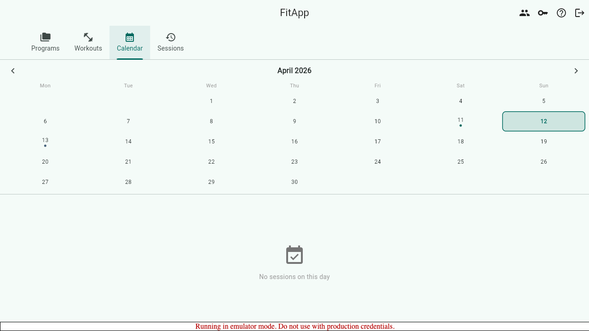
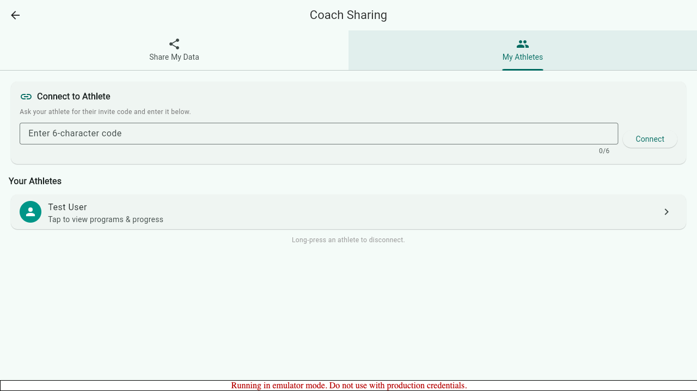

# FitApp

[](https://www.gnu.org/licenses/agpl-3.0)
[](https://github.com/nick-transition/fitapp/actions/workflows/deploy.yml)
[](https://github.com/nick-transition/fitapp/actions/workflows/e2e.yml)

A fitness coaching platform that connects athletes and coaches through structured workout programs, session tracking, and inline video references. Built with Flutter and Firebase as a protocol-style open source project where contributors earn from the revenue pool.

**[Live App](https://fitapp.web.app)** | **[Contributing](CONTRIBUTING.md)** | **[Open Source Model](https://fitapp.web.app/open-source)**

---

## Screenshots

| Landing | Programs | Workouts |
|---------|----------|----------|
|  |  |  |

| Workout Detail + YouTube | Calendar | Coach View |
|--------------------------|----------|------------|
|  |  |  |

## Features

**For Athletes**
- Browse and follow multi-day workout programs with structured exercises
- Log sessions with per-set tracking (reps, weight, notes)
- Calendar view of scheduled and completed workouts
- Inline YouTube reference videos for exercise form

**For Coaches**
- View connected athletes' programs, workouts, and session history
- Share workout programs with athletes via invite codes
- Monitor athlete progress across sessions

**Platform**
- Cross-platform: web, iOS, Android from a single Flutter codebase
- Real-time sync via Firebase Firestore
- Google and email/password authentication
- Stripe-powered subscriptions
- MCP tools for AI-assisted coaching workflows (Claude, ChatGPT, etc.)

## Quick Start

```bash
# Clone and install
git clone https://github.com/nick-transition/fitapp.git
cd fitapp
flutter pub get
npm install --prefix functions

# Start Firebase emulators and seed test data
firebase emulators:start &
node scripts/seed_emulator.js

# Run the app
flutter run -d chrome --dart-define=USE_EMULATORS=true
```

### Test accounts (emulator only)

| Role    | Email                | Password      |
|---------|----------------------|---------------|
| Athlete | testuser@gmail.com   | testpass123   |
| Coach   | coach@gmail.com      | coachpass123  |

## Architecture

```
fitapp/
├── lib/
│   ├── models/          # Exercise, Workout, Program, Session, CoachConnection
│   ├── screens/         # All app screens (home, detail, edit, calendar, coach)
│   ├── services/        # Firebase auth, Firestore, Stripe billing
│   ├── widgets/         # VideoLinkTile, WorkoutCard, SessionCard, etc.
│   └── utils/           # YouTube URL parsing, helpers
├── functions/           # Firebase Cloud Functions (TypeScript)
│   └── src/             # Stripe webhooks, MCP tools, OAuth
├── e2e/                 # Playwright e2e tests with video + screenshot capture
├── scripts/
│   ├── seed_emulator.js # Seed Firebase emulators with test data
│   └── run_e2e.sh       # One-command e2e: emulators + seed + build + Playwright
└── .github/workflows/
    ├── deploy.yml       # Auto-deploy to Firebase Hosting on merge to main
    ├── pr-check.yml     # Build + analyze on PRs
    └── e2e.yml          # Playwright e2e tests + screenshot artifacts on PRs
```

**Stack:** Flutter 3.41 · Firebase (Auth, Firestore, Hosting, Functions) · Stripe · Playwright · GitHub Actions

## Testing

```bash
# Run everything with one command (starts emulators, seeds, builds, runs Playwright)
./scripts/run_e2e.sh

# Or run Playwright tests individually (requires built web app + running emulators)
flutter build web --dart-define=USE_EMULATORS=true
npx playwright test e2e/ --reporter=list
```

E2e tests record video of each test run and capture screenshots of every major screen. Videos and screenshots are uploaded as CI artifacts on every PR.

## Contributing

Contributors earn from FitApp's revenue pool — 25% of subscription revenue is distributed monthly based on contribution points.

See [CONTRIBUTING.md](CONTRIBUTING.md) for the contributor scoring model, AI usage standards, and code guidelines.

## License

AGPL-3.0 — see [LICENSE](LICENSE).
